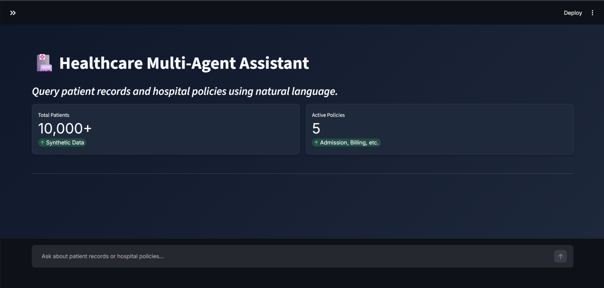
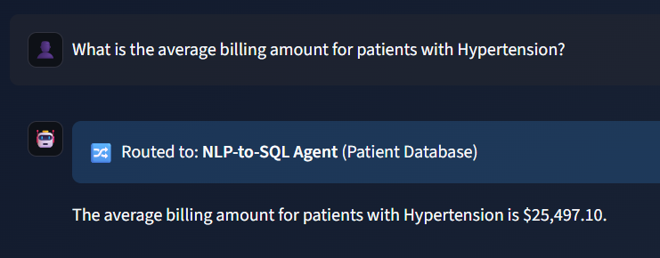
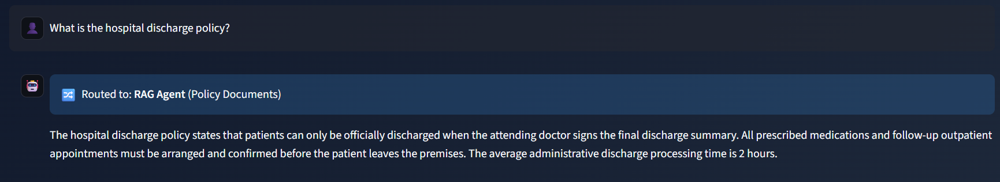
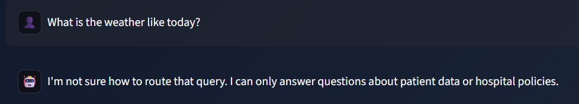

#  RAG-Based Healthcare Query Assistant
### A Multi-Agent Conversational System for Structured (SQL) and Unstructured (RAG) Hospital Data Retrieval


---

##  Project Overview
The **RAG-Based Healthcare Query Assistant** is an AI-powered, multi-agent application developed as part of the **Celebal Excellence Intern Program**. The system enables hospital staff to query both **structured patient records** (via NLP-to-SQL) and **unstructured hospital policy documents** (via RAG) through a single, natural-language conversational interface. 

At the core of the system is an **Orchestrator Agent** that inspects each incoming query, determines the user's intent, and routes the request to the appropriate specialized sub-agent, acting as a single point of contact for all hospital data retrieval needs.

---

## ✨ Key Features
- **🧠 Intelligent Orchestrator:** Automatically routes queries to SQL, RAG, or Fallback based on intent.
- **🗄️ NLP-to-SQL Pipeline:** Translates natural language into precise SQL queries, handling messy data casing and complex aggregations.
-  **📄RAG Pipeline:** Retrieves semantically relevant context from hospital policy documents using FAISS vector search.
- **💬 Conversation Memory:** Maintains short-term context, allowing users to ask stateless follow-up questions (e.g., "List 20 of them").
- **🛡️ Defensive Engineering:** Custom wrappers prevent API crashes from empty database returns, context window overflows, and LLM hallucinations.
- **🎨 Modern Dark UI:** Professional, responsive Streamlit dashboard with system metrics and live status indicators.

---

## ️ Architecture & Multi-Agent System
The application is built around a three-agent architecture:

1. **Orchestrator Agent (Router):** Analyses the user's prompt and classifies its intent into `SQL` (patient data), `RAG` (hospital policies), or `UNKNOWN` (out-of-domain).
2. **NLP-to-SQL Agent:** Translates natural-language questions into syntactically correct SQL queries, executes them against the SQLite database, and formats the raw rows into conversational Markdown tables.
3. **RAG Agent:** Retrieves the top-k most relevant text chunks from the FAISS vector store and uses the retrieved context to generate a grounded, hallucination-resistant answer via the LLM.

---

## 🛠️ Technology Stack

| Component | Technology Used |
| :--- | :--- |
| **Language** | Python 3.10+ |
| **LLM Provider** | Groq API (`llama-3.3-70b-versatile`) — chosen for ultra-low latency |
| **Agent Framework** | LangChain (Agent orchestration, tool calling, prompt templating) |
| **Vector Database** | FAISS (Facebook AI Similarity Search) |
| **Embeddings** | HuggingFace `sentence-transformers/all-MiniLM-L6-v2` (local, zero-cost) |
| **Relational Database** | SQLite, with indexed columns for query performance |
| **Frontend / UI** | Streamlit (Dark-themed, interactive dashboard) |
| **Data Manipulation** | Pandas, NumPy |

---


## 📂 Project Structure & Deliverables

```text
Healthcare_Query_Assistant/
│
├── 📂 notebooks/               # Development, testing & documentation
│   ├── 01_data_preparation.ipynb
│   ├── 02_rag_pipeline.ipynb
│   ── 03_agent_testing.ipynb
│
├── 📂 pipelines/               # Modular pipeline components
│   ├── __init__.py
│   ├── sql_pipeline.py         # NLP-to-SQL Agent logic
│   └── rag_pipeline.py         # RAG Agent logic
│
├── 📂 policies/                # Raw synthetic hospital policy documents
├── 📂 faiss_index/             # Saved FAISS vector database
│
├── app.py                      # Main entry point (Streamlit UI & Integration)
├── backend.py                  # AI Logic (LLM, Agents, Safety Patches)
├── ui.py                       # UI Logic (CSS, Sidebar, Chat Interface)
├── healthcare.db               # Cleaned, indexed SQLite patient database
├── healthcare_dataset.csv      # Original raw dataset
│
├── 📄 Final Project Report @ Celebal Tech.pdf  # Comprehensive project documentation
│
├── ️ image-1.png              # Dashboard screenshot
├── 🖼️ image-2.png              # SQL Agent query screenshot
├── 🖼️ image-3.png              # RAG Agent query screenshot
├── ️ image-4.png              # Out-of-domain handling screenshot
│
├── agent_routing.log           # Backend log providing proof of routing decisions
├── requirements.txt            # Python dependencies
├── README.md                   # Project documentation
└── .gitignore                  # Git ignore rules (excludes .env, __pycache__, etc.)

---

## 🚀 Getting Started

### 1. Prerequisites
- Python 3.10 or higher
- A free Groq API Key (Get one at [console.groq.com](https://console.groq.com))

### 2. Installation
Clone the repository and install dependencies:
```bash
git clone <your-repo-url>
cd Healthcare_Query_Assistant
pip install -r requirements.txt
```

### 3. Environment Setup
Create a `.env` file in the root directory and add your Groq API key:
```env
GROQ_API_KEY=gsk_your_groq_api_key_here
```

### 4. Run the Application
Launch the Streamlit web interface:
```bash
streamlit run app.py
```

---

## 🛠️ Key Engineering Challenges & Solutions

Building a production-style multi-agent system surfaced several real-world AI engineering problems. Each was diagnosed and resolved during development:

### 1. LLM Hallucinations (Inventing Non-Existent Columns)
**Problem:** The SQL Agent occasionally invented column names that did not exist in the schema (e.g., `patient_name` instead of `Name`), causing SQL execution errors.
**Solution:** The system prompt was updated to explicitly enumerate the exact allowed column names and strictly forbid the LLM from inventing new ones.

### 2. API Crashes on Empty Results (400 Bad Request)
**Problem:** When a SQL query returned zero rows, LangChain passed an empty string back to the LLM. The APIs strictly reject empty tool messages, causing a 400 error.
**Solution:** A custom `safe_output` tool wrapper was created to intercept all tool executions. Whenever a result is empty, it safely returns the message "No results found." instead of an empty payload.

### 3. Context Window Overflow on Large Result Sets
**Problem:** Broad queries such as "all patients" returned thousands of rows, overflowing the LLM's context window and crashing the application.
**Solution:** The `safe_output` wrapper was extended to detect when a result string exceeds 4,000 characters. It truncates the text and injects a `[SYSTEM NOTE]` instructing the model to summarise the data.

### 4. Azure Firewall Blocking Legitimate SQL Payloads (403 Forbidden)
**Problem:** While using the Sarvam AI API, the Azure Application Gateway mistakenly flagged SQL keywords in the request payload as a SQL injection attack and blocked the request.
**Solution:** The LLM backend was migrated to the **Groq API**, which avoided the firewall issue entirely and reduced end-to-end response latency to under 2 seconds.

### 5. Stateless Handling of Follow-Up Queries
**Problem:** A follow-up such as "List 20", sent after an initial query, was misclassified by the Router as an out-of-domain query because it lacked explicit context.
**Solution:** The Orchestrator prompt was updated to explicitly recognise short, numerical follow-up commands as continuations of the previous SQL intent, preserving conversational context.

---

## 📊 Screenshots & Demonstration

*For detailed visual demonstrations, please refer to the [Final Project Report](Final%20Project%20Report%20@%20Celebal%20Tech.pdf).*

**Figure 1:** Main Dashboard Interface  
**

**Figure 2:** NLP-to-SQL Agent performing SQL aggregation  
**

**Figure 3:** RAG Agent retrieving and synthesizing hospital policy information  
**

**Figure 4:** Out-of-Domain Query Handling and Fallback Mechanism  
**

---

## 📜 License
This project is built for educational and demonstration purposes for the Celebal Excellence Intern Program at Celebal Technologies.